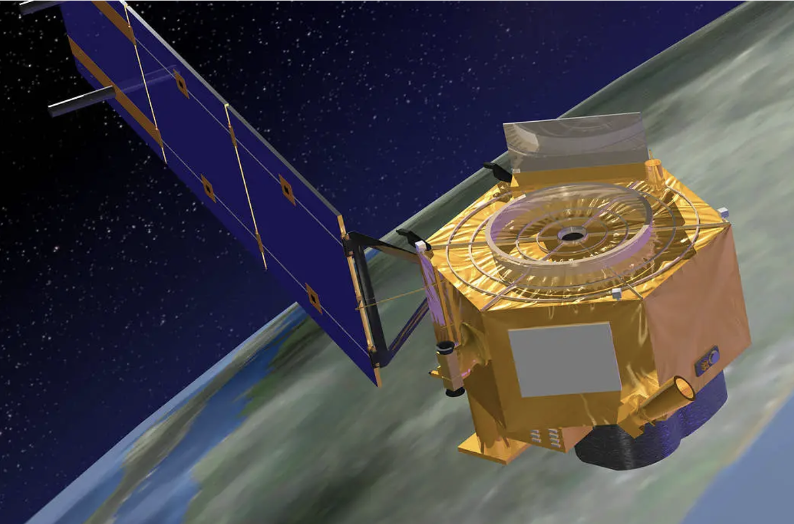
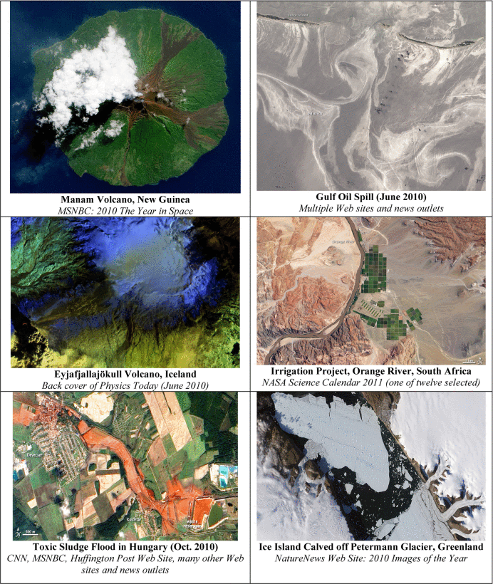

```{r echo=FALSE}
library(RefManageR)
library(knitcitations)

options(htmltools.dir.version = FALSE)

# Citing Options
BibOptions(check.entries = FALSE,
           bib.style = "authoryear",
           cite.style = "authoryear",
           style = "markdown",
           hyperlink = TRUE,
           dashed = FALSE,
           no.print.fields=c("doi", "url", "urldate", "issn"))
RS2 <- ReadBib("RS2.bib", check = FALSE)
```

## Summary of EO-1

Launched on November 21, 2000, the Earth Observing-1 (EO-1) satellite was intended to be a one-year technology validation and demonstration mission. NASA and the USGS decided to extend the EO-1 program as an Extended Mission following the conclusion of the primary technology mission. 

In accordance with customer tasking needs, the EO-1 Extended Mission is tasked with gathering and distributing Hyperion hyperspectral and Advanced Land Imager (ALI) multispectral products`r Citep(RS2,"EarthObserving1NASA")`.

```{r echo=FALSE, out.width='55%', fig.align='center'}

```

Source from: `r Citet(RS2, "EarthObservingMission")`
---
## Hyperion Instrument on board the EO-1 spacecraft

With a 10-nm bandwidth, Hyperion gathers 220 distinct spectral channels between 0.357 and 2.576 micrometers. The device uses a pushbroom method of operation and has a 30-meter spatial resolution across all bands. The scene breadth is 7.7 kilometers on average. 42 kilometers is the standard scene length; 185 kilometers is an optionally extended scene length.

All Hyperion and Advanced Land Imager (ALI) data in the archive will be attempted to be processed to the Level 1Gst level of correction.

---
## Science goals

1. Validate and test new technologies that could provide significant cost reductions and improved performance for future Landsat missions.
2. Provide a science-grade space-borne hyperspectral instrument, thus providing a new class of Earth observation data for improved Earth surface characterization.
3. Provide the first space-based test of an onboard atmospheric corrector for increasing the accuracy of surface reflectance estimates.

```{r echo=FALSE, out.width='50%', fig.align='center', fig.cap="NASA Earth Observatory images by Wanmei Liang, using Landsat data from the U.S. Geological Survey and VIIRS day-night band data from the Suomi National Polar-orbiting Partnership" }
knitr::include_graphics("https://eoimages.gsfc.nasa.gov/images/imagerecords/152000/152538/fernandinavolcano_oli_20240307.jpg")
```

---
## Related applications

Examples include: (top row) the active Manam Volcano (2010), and the 2010 Gulf Oil Spill; (middle row) the 2010 Eyjafjallajökull volcanic activity in Iceland (Physics Today), and an irrigation project in South Africa (chosen for the 2011 NASA Science Calendar); (bottom row) the 2010 Toxic Sludge Flood in Hungary, and the Petermann Glacier, Greenland.

```{r echo=FALSE, out.width='40%', fig.align='center' }

```
Source from: `r Citet(RS2, "EarthObservingOne")`
---
## Fields and Applications


| Science Area | Approaches | 
|-------|-------|
| Carbon Cycle | Carbon Management,Energy Management etc. | 
| Ecosystems | Coastal Management, Public Health etc. | 
| Biogeochemistry | Biodiversity(including marine) |
| Earth Surface and Interior | Public Health, Homeland Security |


---
## Reflections of EO-1

Technological innovations and challenges

· Because hyperspectral data are complex, processing and analyzing them can be challenging. The EO-1 mission aims to address these challenges. The procedures involved in data collection, transmission, processing, and user access are also intricate.

· Being a pioneer in the field of hyperspectral imaging, the EO-1 Hyperion instrument set the stage for later space imaging technologies and revolutionized Earth observation capabilities. Later sensors, on the other hand, are more sophisticated and have a wider field of view.

---
## EO 1 (Earth Observing-1) satellite launch

Very exciting video!!!!

This is a groundbreaking satellite for the new century, with technology designed to enable the development of future Earth-imaging observatories that will significantly improve performance while reducing cost and quality.

```{r echo=FALSE}
htmltools::tags$div(class = "center", 
                    htmltools::tags$iframe(width = "550", height = "350", src = "https://www.youtube.com/embed/d-F-iPw3mrM", frameborder = "0", allow = "accelerometer; autoplay; encrypted-media; gyroscope; picture-in-picture", allowfullscreen = TRUE))
```
Source from: https://www.youtube.com/watch?v=d-F-iPw3mrM
---
## Implications 

· On the evolution of technologies and methods, based on the experience of EO-1 and Hyperion. Foundations are laid for future Earth observation missions in terms of technology, data analysis and user services.

· On interdisciplinary cooperation, with important implications for future complex Earth observation projects.

· Global Environmental Governance

· Data sharing and open science, considering the contribution of the EO-1 project to the promotion of principles of openness and sharing of scientific data, and the implications of this for enhancing global scientific research and cooperation.

---
## Reference

```{r results='asis', echo=FALSE}

PrintBibliography(RS2)


```


